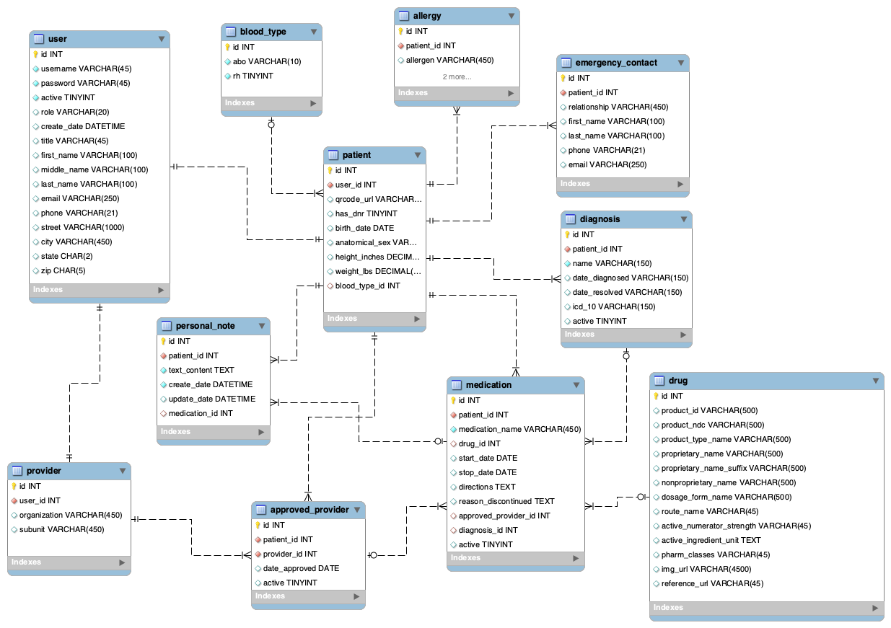

## Team Windy Daydreamer
* Craig Dreiling - Scrum Master
* Emily Lau - Team Sweeper
* Miguel Marsiglia - Repo Owner
* Cecil Kitch - DBA

### Summary / Overview
QRx - Patient/Provider Interface. A collaborative proof of concept for streamlining emergency medical provider access to patient information. Utilizes restful services to provide a single, dependable source for patient healthcare providers to access their patients' medication lists.

### Technologies Used
* mySQL
* Java Persistance API
* Spring Boot, Spring Data, Spring Rest, Spring Security
* Angular/TS
* Angular Material Component Library
* Bootstrap Component Library
* HTML5/CSS3/JS

### Demo Application
http://3.130.50.134:8080/QRx/#/login

### Entity Diagram

